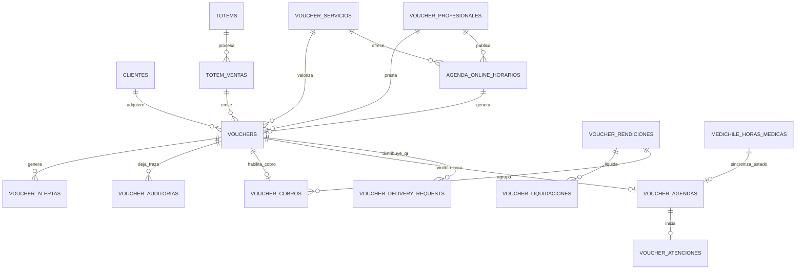

# Modelo Entidad–Relación — Sistema de Bonos Medichile

**Documento técnico para expediente de Registro de Propiedad Intelectual**  
**Sistema:** Sistema de Bonos Medichile — SDI Salud Digital Integrada  
**Versión del MER:** 1.0  
**Fecha:** 23 de agosto de 2026  
**Autor/solicitante de referencia:** Jaime Kriman  
**Motor de persistencia:** MySQL  
**Framework de implementación:** Laravel 13 / PHP 8.4

## 1. Objeto del modelo

El modelo representa la estructura lógica original del sistema que gestiona el ciclo completo de un bono médico digital: validación del beneficiario y del convenio, reserva de hora, compra y emisión del QR, entrega, recepción, atención clínica, cobro profesional, auditoría, autorización, depósito y trazabilidad administrativa.

El MER fue levantado desde los modelos y migraciones del proyecto `SISTEMA-DE-BONOS-DEMO`. Se excluyen del modelo conceptual las tablas técnicas del framework —sesiones, colas, recuperación de contraseñas y tokens de infraestructura— y cualquier estructura heredada que no participe en el dominio médico vigente.

## 2. Límites y bases integradas

El diseño se distribuye en tres dominios persistentes:

1. **Base principal `sistema_bonos_demo`:** usuarios, pacientes, profesionales, servicios, agenda online, bonos, QR, atención, cobro, rendición, liquidación, auditoría y tótems.
2. **Base Personas:** consulta por RUT y complemento cifrado de datos de contacto y dirección.
3. **Base Medichile:** pacientes, profesionales y horas médicas que sincronizan los estados `Confirmada`, `Espera`, `Realizando` y `Realizada`.

## 3. Entidad central

`VOUCHERS` es la entidad transaccional principal. Vincula al beneficiario, profesional, prestación, agenda y canal de emisión. Desde ella se derivan la entrega del QR, atención clínica, cobro, auditoría, rendición, liquidación y registros de trazabilidad.

## 4. Reglas cardinales

- Un cliente puede adquirir muchos bonos; cada bono pertenece a un cliente.
- Un profesional puede ofrecer muchos horarios, atender muchos bonos y solicitar muchos cobros.
- Un servicio puede aparecer en muchos horarios y bonos.
- Un horario disponible puede generar como máximo un bono.
- Un bono puede tener una agenda y una atención clínica.
- Un bono habilitado puede originar un único cobro vigente dentro del flujo normal.
- Una rendición agrupa uno o varios cobros del mismo profesional.
- Una rendición puede producir una o varias liquidaciones según el proceso administrativo.
- Cada cambio relevante genera uno o más registros de auditoría inmutables.
- Una hora de Medichile se sincroniza con la agenda del bono y conserva la correspondencia paciente–profesional–lugar–fecha.
- El RUT se consulta de forma normalizada o mediante hash; los datos sensibles se conservan cifrados cuando corresponde.

## 5. Diagrama editable

El diagrama fuente se encuentra en `MER-SISTEMA-BONOS-DEMO-RPI.mmd` y utiliza sintaxis Mermaid `erDiagram`. Puede abrirse con Mermaid Live Editor, Visual Studio Code con extensión Mermaid o cualquier editor compatible.

## 6. Módulos representados

| Módulo | Entidades principales | Responsabilidad |
|---|---|---|
| Identidad y autorización | `users`, `clientes`, `cliente_dispositivos`, `cliente_autorizaciones` | Perfiles, autenticación y aprobación del paciente. |
| Convenios y preconsulta | `voucher_base_usuarios`, `voucher_base_relaciones`, `voucher_preconsultas` | Valida cobertura y relación antes de emitir. |
| Catálogo y agenda | `voucher_profesionales`, `voucher_servicios`, `agenda_online_horarios` | Profesional, especialidad, nivel, valor, copago y disponibilidad. |
| Bono y QR | `vouchers`, `voucher_delivery_requests` | Compra, token firmado, entrega por WhatsApp/email y vigencia. |
| Atención clínica | `voucher_agendas`, `voucher_atenciones` | Recepción, espera, diagnóstico y cierre profesional. |
| Ciclo financiero | `voucher_cobros`, `voucher_rendiciones`, `voucher_liquidaciones` | Cobro, agrupación, autorización y depósito. |
| Auditoría | `voucher_auditorias`, `voucher_alertas` | Evidencia, control, objeciones y trazabilidad. |
| Tótem | `totems`, `totem_ventas` | Compra y autoatención presencial. |
| Integraciones | Personas y Medichile | Autollenado por RUT y sincronización de la hora médica. |

## 7. Identificación de originalidad técnica

La organización del modelo expresa como conjunto integrado:

- continuidad del bono desde la preconsulta hasta el depósito;
- asociación verificable paciente–profesional–prestación–lugar–fecha;
- QR firmado usado tanto en entrega como en expediente de cobro;
- sincronización de estados con agenda Medichile;
- autorización u objeción auditada antes del depósito;
- separación de información pública, clínica, bancaria e interna;
- trazabilidad por usuario, rol, fecha, IP, acción y comprobante.

## 8. Nota de presentación

Este MER documenta la arquitectura lógica del software. Para un expediente de propiedad intelectual se recomienda acompañarlo con portada de identificación del autor, descripción funcional, código fuente, manual de instalación, capturas de las vistas principales y hash del archivo ZIP entregado.

